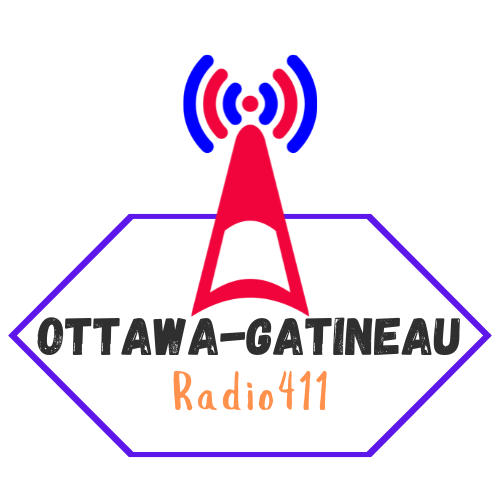

=  ARLHS Lighthouses / Phares ARLHS
:showtitle:
:imagesdir: images
:data-uri:

.ARLHS Lighthouses / Phares ARLHS
|===
| ARLHS Number/Numéro ARLHS | Name/Nom | Location | Submitted by/Soumis par | Reference

|CAN 1433
|12 Mile Island Ile Allen
|https://openstreetmap.org/?mlat=45.49&mlon=-76.02&zoom=19[45.49, -76.02^]
|Ante Laurijssen, VA2BBW
|https://wlol.arlhs.com/lighthouse/CAN1433.html[^]

|CAN 1432
|Armitage Marina West
|https://openstreetmap.org/?mlat=45.4767&mlon=-75.9933&zoom=19[45.4767, -75.9933^]
|Ante Laurijssen, VA2BBW
|https://wlol.arlhs.com/lighthouse/CAN1432.html[^]

|CAN 1044
|Arnprior Island (Ottawa River) (New)
|https://openstreetmap.org/?mlat=45.4567&mlon=-76.3533&zoom=19[45.4567, -76.3533^]
|Ante Laurijssen, VA2BBW
|https://wlol.arlhs.com/lighthouse/CAN1044.html[^]

|CAN 1434
|Arnprior Island (Ottawa River) Old
|https://openstreetmap.org/?mlat=45.4567&mlon=-76.3533&zoom=19[45.4567, -76.3533^]
|Ante Laurijssen, VA2BBW
|https://wlol.arlhs.com/lighthouse/CAN1434.html[^]

|CAN 867
|Aylmer Island (Ottawa River) (New)
|https://openstreetmap.org/?mlat=45.3967&mlon=-75.8883&zoom=19[45.3967, -75.8883^]
|Ante Laurijssen, VA2BBW
|https://wlol.arlhs.com/lighthouse/CAN867.html[^]

|CAN 1437
|Aylmer Island (Ottawa River) (Old)
|https://openstreetmap.org/?mlat=45.3967&mlon=-75.8883&zoom=19[45.3967, -75.8883^]
|Ante Laurijssen, VA2BBW
|https://wlol.arlhs.com/lighthouse/CAN1437.html[^]

|CAN 1431
|Aylmer Marina
|https://openstreetmap.org/?mlat=45.395&mlon=-75.8583&zoom=19[45.395, -75.8583^]
|Ante Laurijssen, VA2BBW
|https://wlol.arlhs.com/lighthouse/CAN1431.html[^]

|CAN 1046
|Baskins Wharf Range Front (Ottawa River) (New)
|https://openstreetmap.org/?mlat=45.48&mlon=-76.0067&zoom=19[45.48, -76.0067^]
|Ante Laurijssen, VA2BBW
|https://wlol.arlhs.com/lighthouse/CAN1046.html[^]

|CAN 1047
|Baskins Wharf Range Rear (Ottawa River) (New)
|https://openstreetmap.org/?mlat=45.4783&mlon=-76.005&zoom=19[45.4783, -76.005^]
|Ante Laurijssen, VA2BBW
|https://wlol.arlhs.com/lighthouse/CAN1047.html[^]

|CAN 023
|Bass River
|https://openstreetmap.org/?mlat=45.4783&mlon=-76.005&zoom=19[45.4783, -76.005^]
|Ante Laurijssen, VA2BBW
|https://wlol.arlhs.com/lighthouse/CAN023.html[^]

|CAN 900
|Bathurst Front Range Light
|https://openstreetmap.org/?mlat=45.4783&mlon=-76.005&zoom=19[45.4783, -76.005^]
|Ante Laurijssen, VA2BBW
|https://wlol.arlhs.com/lighthouse/CAN900.html[^]

|CAN 901
|Bathurst Rear Range Light
|https://openstreetmap.org/?mlat=45.4783&mlon=-76.005&zoom=19[45.4783, -76.005^]
|Ante Laurijssen, VA2BBW
|https://wlol.arlhs.com/lighthouse/CAN901.html[^]

|CAN 1050
|Britannia (Ottawa River)
|https://openstreetmap.org/?mlat=45.365&mlon=-75.8067&zoom=19[45.365, -75.8067^]
|Ante Laurijssen, VA2BBW
|https://wlol.arlhs.com/lighthouse/CAN1050.html[^]

|CAN 1030
|Brockville Range Rear/Crossover Range Rear (St. Lawrence River) Crossover Range Rear/Brockville Range Rear (St. Lawrence River), ON
|https://openstreetmap.org/?mlat=44.5333&mlon=-75.7667&zoom=19[44.5333, -75.7667^]
|Ante Laurijssen, VA2BBW
|https://wlol.arlhs.com/lighthouse/CAN1030.html[^]

|CAN 1051
|Bronte (Lake Ontario)
|https://openstreetmap.org/?mlat=44.5333&mlon=-75.7667&zoom=19[44.5333, -75.7667^]
|Ante Laurijssen, VA2BBW
|https://wlol.arlhs.com/lighthouse/CAN1051.html[^]

|CAN 061
|Bruce Mines
|https://openstreetmap.org/?mlat=44.5333&mlon=-75.7667&zoom=19[44.5333, -75.7667^]
|Ante Laurijssen, VA2BBW
|https://wlol.arlhs.com/lighthouse/CAN061.html[^]

|CAN 1052
|Buckham Point (Ottawa River)
|https://openstreetmap.org/?mlat=45.5117&mlon=-76.0933&zoom=19[45.5117, -76.0933^]
|Ante Laurijssen, VA2BBW
|https://wlol.arlhs.com/lighthouse/CAN1052.html[^]

|CAN 1382
|Budget (Indian Harbour)
|https://openstreetmap.org/?mlat=45.5117&mlon=-76.0933&zoom=19[45.5117, -76.0933^]
|Ante Laurijssen, VA2BBW
|https://wlol.arlhs.com/lighthouse/CAN1382.html[^]

|CAN 865M
|Cape North (Old) (Museum of Science and Technology/Ottawa) Cape North (Old), NS H
|https://openstreetmap.org/?mlat=45.4017&mlon=-75.6233&zoom=19[45.4017, -75.6233^]
|Ante Laurijssen, VA2BBW
|https://wlol.arlhs.com/lighthouse/CAN865M.html[^]

|CAN 1456
|Cooks Point Light 68
|https://openstreetmap.org/?mlat=44.9317&mlon=-75.0783&zoom=19[44.9317, -75.0783^]
|Ante Laurijssen, VA2BBW
|https://wlol.arlhs.com/lighthouse/CAN1456.html[^]

|CAN 147
|Coppermine Point
|https://openstreetmap.org/?mlat=44.9317&mlon=-75.0783&zoom=19[44.9317, -75.0783^]
|Ante Laurijssen, VA2BBW
|https://wlol.arlhs.com/lighthouse/CAN147.html[^]

|CAN 1028
|Corbeil Point (Lake Superior)
|https://openstreetmap.org/?mlat=44.9317&mlon=-75.0783&zoom=19[44.9317, -75.0783^]
|Ante Laurijssen, VA2BBW
|https://wlol.arlhs.com/lighthouse/CAN1028.html[^]

|CAN 1350
|Corunna Range Front (St. Clair River)
|https://openstreetmap.org/?mlat=44.9317&mlon=-75.0783&zoom=19[44.9317, -75.0783^]
|Ante Laurijssen, VA2BBW
|https://wlol.arlhs.com/lighthouse/CAN1350.html[^]

|CAN 1029M
|Corunna Range Rear (Moore Museum) Corunna Range Rear (St. Clair River), ON H
|https://openstreetmap.org/?mlat=44.9317&mlon=-75.0783&zoom=19[44.9317, -75.0783^]
|Ante Laurijssen, VA2BBW
|https://wlol.arlhs.com/lighthouse/CAN1029M.html[^]

|CAN 1029H
|Corunna Range Rear (St. Clair River)
|https://openstreetmap.org/?mlat=44.9317&mlon=-75.0783&zoom=19[44.9317, -75.0783^]
|Ante Laurijssen, VA2BBW
|https://wlol.arlhs.com/lighthouse/CAN1029H.html[^]

|CAN 966
|Coteau Landing (St. Lawrence River)
|https://openstreetmap.org/?mlat=44.9317&mlon=-75.0783&zoom=19[44.9317, -75.0783^]
|Ante Laurijssen, VA2BBW
|https://wlol.arlhs.com/lighthouse/CAN966.html[^]

|CAN 1061
|Dickinson Landing (St. Lawrence River)
|https://openstreetmap.org/?mlat=44.945&mlon=-75.0667&zoom=19[44.945, -75.0667^]
|Ante Laurijssen, VA2BBW
|https://wlol.arlhs.com/lighthouse/CAN1061.html[^]

|CAN 1352
|Graham Bay/Stillwater Park (Ottawa River) Stillwater Park/Graham Bay (Ottawa River), ON
|https://openstreetmap.org/?mlat=45.3533&mlon=-75.8233&zoom=19[45.3533, -75.8233^]
|Ante Laurijssen, VA2BBW
|https://wlol.arlhs.com/lighthouse/CAN1352.html[^]

|CAN 811
|Green Shoal (Ottawa River) Beacon Hill
|https://openstreetmap.org/?mlat=45.4733&mlon=-75.595&zoom=19[45.4733, -75.595^]
|Ante Laurijssen, VA2BBW
|https://wlol.arlhs.com/lighthouse/CAN811.html[^]

|CAN 1452
|Mariatown Light 92
|https://openstreetmap.org/?mlat=44.8817&mlon=-75.2033&zoom=19[44.8817, -75.2033^]
|Ante Laurijssen, VA2BBW
|https://wlol.arlhs.com/lighthouse/CAN1452.html[^]

|CAN 1453
|Mariatown Range Front
|https://openstreetmap.org/?mlat=44.8833&mlon=-75.2083&zoom=19[44.8833, -75.2083^]
|Ante Laurijssen, VA2BBW
|https://wlol.arlhs.com/lighthouse/CAN1453.html[^]

|CAN 1454
|Mariatown Range Rear
|https://openstreetmap.org/?mlat=44.8833&mlon=-75.2083&zoom=19[44.8833, -75.2083^]
|Ante Laurijssen, VA2BBW
|https://wlol.arlhs.com/lighthouse/CAN1454.html[^]

|CAN 307
|Mark Point
|https://openstreetmap.org/?mlat=44.8833&mlon=-75.2083&zoom=19[44.8833, -75.2083^]
|Ante Laurijssen, VA2BBW
|https://wlol.arlhs.com/lighthouse/CAN307.html[^]

|CAN 1210
|Marshall Cove/Port Lorne/Port Williams (Bay of Fundy) Port Lorne/Port Williams/Marshall Cove (Bay of Fundy), NS H : Port Williams/Marshall Cove/Port Lorne (Bay of Fundy), NS H
|https://openstreetmap.org/?mlat=44.8833&mlon=-75.2083&zoom=19[44.8833, -75.2083^]
|Ante Laurijssen, VA2BBW
|https://wlol.arlhs.com/lighthouse/CAN1210.html[^]

|CAN 1077
|Morris Island (Ottawa River)
|https://openstreetmap.org/?mlat=45.4617&mlon=-76.2883&zoom=19[45.4617, -76.2883^]
|Ante Laurijssen, VA2BBW
|https://wlol.arlhs.com/lighthouse/CAN1077.html[^]

|CAN 769
|Sand Point
|https://openstreetmap.org/?mlat=45.4883&mlon=-76.435&zoom=19[45.4883, -76.435^]
|Ante Laurijssen, VA2BBW
|https://wlol.arlhs.com/lighthouse/CAN769.html[^]

|CAN 445
|Sand Point
|https://openstreetmap.org/?mlat=45.4883&mlon=-76.435&zoom=19[45.4883, -76.435^]
|Ante Laurijssen, VA2BBW
|https://wlol.arlhs.com/lighthouse/CAN445.html[^]

|CAN 1455
|Weaver Shoal Light 68
|https://openstreetmap.org/?mlat=44.9317&mlon=-75.0683&zoom=19[44.9317, -75.0683^]
|Ante Laurijssen, VA2BBW
|https://wlol.arlhs.com/lighthouse/CAN1455.html[^]

|CAN 1244
|Wedge Island
|https://openstreetmap.org/?mlat=44.9317&mlon=-75.0683&zoom=19[44.9317, -75.0683^]
|Ante Laurijssen, VA2BBW
|https://wlol.arlhs.com/lighthouse/CAN1244.html[^]

|===